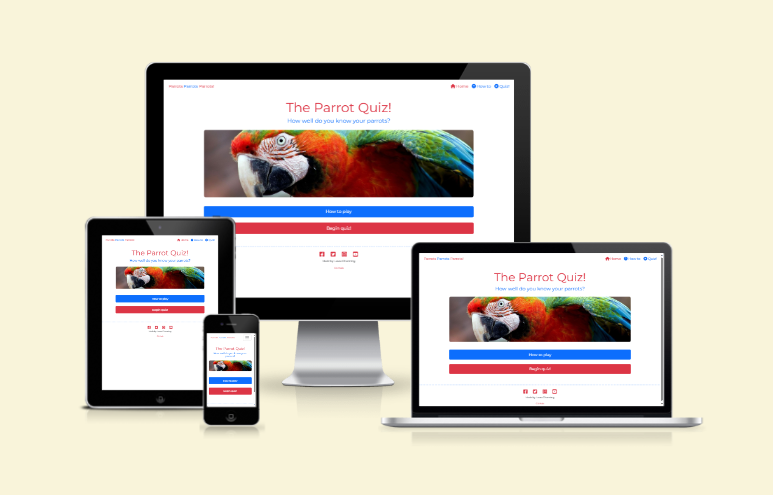
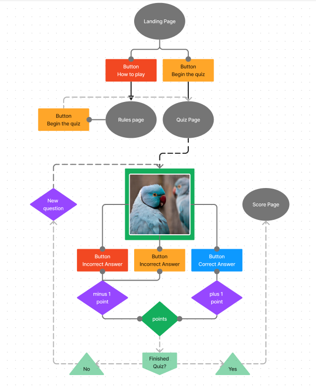
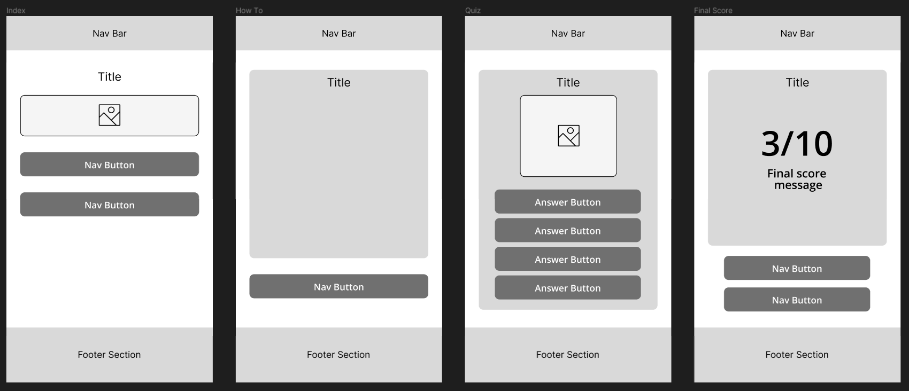
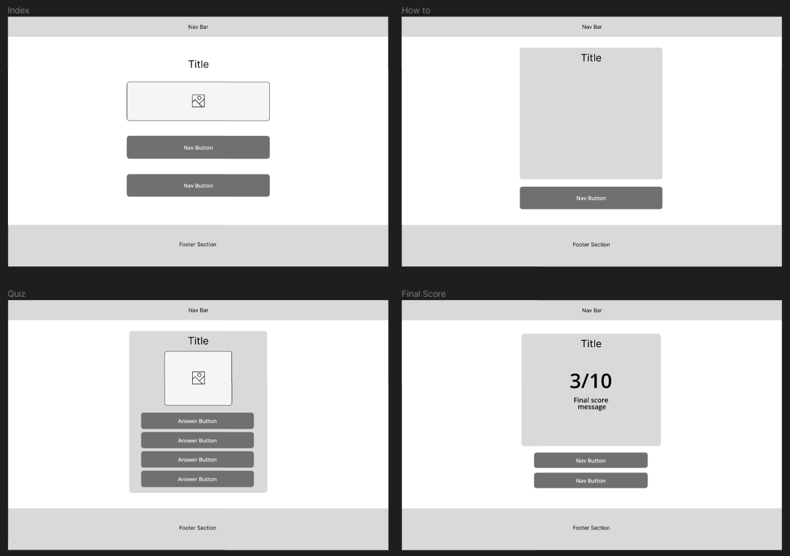
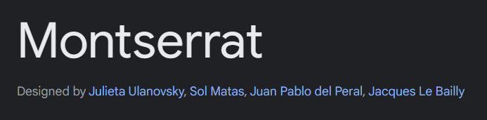
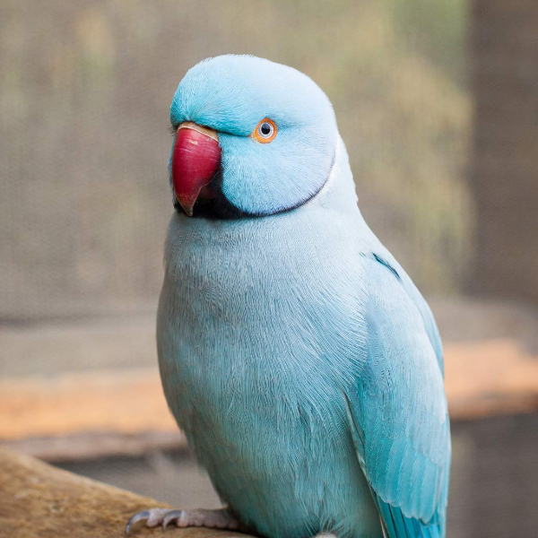
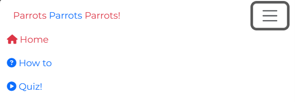
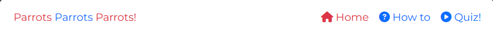
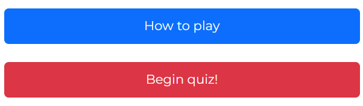

# Parrots Parrots Parrots! <!-- omit in toc -->

[Testing Documentation](https://github.com/lrchnnng/parrot-quiz/blob/main/testing.md)

[Live Site](https://lrchnnng.github.io/parrot-quiz/)

 

# Table of contents <!-- omit in toc -->
- [1. Website Information](#1-website-information)
- [2. UX](#2-ux)
  - [2.1 Strategy](#21-strategy)
  - [2.2 Scope](#22-scope)
  - [2.3 Structure](#23-structure)
  - [2.4 Skeleton](#24-skeleton)
  - [2.5 Surface](#25-surface)
- [3. Technologies Used](#3-technologies-used)
- [4. Testing](#4-testing)
- [5. User Story](#5-user-story)
- [6. Deployment](#6-deployment)
- [7. Credits and Acknowledgments](#7-credits-and-acknowledgments)

## 1. Website Information 
Business goals: 
* Provide a fun and educational quiz for users
* Provide easily readable instructions
* Provide an easy to navigate website

### 1.1 Website Sections: <!-- omit from toc -->
1. Home/Landing Page
2. How to play
3. Quiz
4. Scores

---

## 2. UX 

Whilst designing and creating this website I have taken into account the five planes of UX design, strategy, scope, structure, skeleton and surface.

### 2.1 Strategy
This plane is the first, it involves identifying the goals and objectives of the site and the user. By identifying these first, design decisions can be made that meet these goals.

**User and site goals**
Target users for Parrots Parrots Parrots!:
* Ages 10 +
* Parrot lovers
* People who want to learn more about parrots

First time and returning user goals: 
* To easily and intuitively access different pages of the site.
* To learn about different species of parrots.
* To test current knowledge of various parrot species.
* To gain a fun fact once final score has been displayed.
* Access social media pages related to the site.

One of the main goals for my website was to create an intuitive experience making the page easy to navigate without the user having to think too much about their next move. With the understanding that my user demographic is most likely viewing the website across a variety of devices, I have made sure that the site is fully responsive across screen sizes in order to optimize user experience.

### 2.2 Scope
The second plane of UX looks at the **scope** of the website. What does the user have to do in order to reach both the user and the site owners goals for the website.

#### Features <!-- omit in toc -->

|Landing Page|A simple landing page allowing users to navigate the site|
|:---:|---|
|`Nav Bar`|A responsive navigation bar that allows for easy navigation to every page of the site|
|`H1`|Used for the title of the quiz|
|`H2`|Used for the quiz tagline|
|`Image`|A landing image|
|`Button`|A button navigating to the how to page|
|`Button`|A button navigating to the quiz page|
|`Footer`|A simple footer section with site creator info, a text link and social media links|

|How To Page|A page that explains how the quiz will work|
|:---:|---|
|`Nav Bar`|A responsive navigation bar that allows for easy navigation to every page of the site|
|`H1`|Used for the title of the page|
|`Instructions`|A list of instructions for the user|
|`Button`|A button navigating to the quiz page|
|`Footer`|A simple footer section with site creator info, a text link and social media links|

|Quiz Page|An interactive quiz page with an image as the question and four options for the user to choose from|
|:---:|---|
|`Nav Bar`|A responsive navigation bar that allows for easy navigation to every page of the site|
|`H1`|Used for the title of the page|
|`Score`|a score that updates after user selects an answer|
|`Image`|An image of a parrot that changes depending on the question|
|`Buttons`|Four buttons that log the users choice of answer|
|`Footer`|A simple footer section with site creator info, a text link and social media links|

|Final Score Page|A simple landing page allowing users to navigate the site|
|:---:|---|
|`Nav Bar`|A responsive navigation bar that allows for easy navigation to every page of the site|
|`H1`|Used for the title of the page|
|`Message`|A short message that changes depending on the user score|
|`Score`|A display of the users final score|
|`Fun fact`|A randomised fun fact that changes when the page is loaded|
|`Button`|A button navigating to the how to page|
|`Button`|A button navigating to the quiz page|
|`Animation`|An animated confetti canon that triggers when the page is loaded|
|`Footer`|A simple footer section with site creator info, a text link and social media links|

### 2.3 Structure
The structure plane deals with the organising and arrangment of elements within the user interface. Creating userflows to define how the user will interact with the page. A big goal of the structure plane is to ensure that the users can easily find and access the information they need.

I created a userflow diagram to show how the user will interact with each page on the site.
While I had originally planned for the user to lose a point when they answered the question incorrectly, I chose to change this to make it a more fun experience to a younger audience.

Click here for userflow

### 2.4 Skeleton
This plane is a more refined view of the user interface. Looking at the layout and visual hierarchy to ensure the site is both visually appealing and functional. I created a set of wireframes for different screen sizes, this is a simplified version of the final product, removing colour, typography, imagery to create a basic view of website and establish the layout.

| Mobile Wireframes | Desktop Wireframes |
|:---:|:---:|
|||

*Note: Some areas have changed between the wireframes and the final product, this is either due to making the page easier to navigate or an added function later in development.*

### 2.5 Surface
The surface plane is the last layer and deals with the aesthetics of the user interface. This includes colour palettes, typography, graphics and visual style. The goal of this plane is to create a page that is visually pleasing and engaging for the user.

| Type | Image | Description|
|:---:|---|---|
|Typography|| I opted to use 'Montserrat' across the entire site as it is a simple and easy to read font that has a number of different style options that can be utilised in different areas. |
|Colours||I chose to use a simple primary colour palette to keep the pages looking clean and easy to read.|
|Photography||I used royalty free images of parrots from google images.|

---

## 3. Technologies Used

### Languages <!-- omit in toc -->

[HTML](https://developer.mozilla.org/en-US/docs/Web/HTML): Used to create the basic structure of the webpage.

[CSS](https://developer.mozilla.org/en-US/docs/Learn/Getting_started_with_the_web/CSS_basics): Used to style the content within the webpage.

[JavaScript](https://www.javascript.com/): Used with Bootstrap in order to create a responsive drop down nav bar on mobile and tablet devices and to create interactivitiy within the quiz.

### Libraries <!-- omit in toc -->

[Bootstrap](https://getbootstrap.com/): Used to create fully responsive navbar, buttons and images.

[jQuery](https://jquery.com/): Used to simplify and streamline JS code.

### Design <!-- omit in toc -->

[Google Fonts](https://fonts.google.com/): Used to add in specific fonts to the webpage.

[Figma](): Used to create userflow and wireframes.

[Affinity Designer](): Used to create colour palette and resize images.

### Other <!-- omit in toc -->
[Font-size Clamp Generator](https://clamp.font-size.app/?config=eyJyb290IjoiMTYiLCJtaW5XaWR0aCI6IjMyMHB4IiwibWF4V2lkdGgiOiIxMDI0cHgiLCJtaW5Gb250U2l6ZSI6IjI0cHgiLCJtYXhGb250U2l6ZSI6IjYwcHgifQ%3D%3D): Used to create responsive text sizes.

[JS Confetti](https://confetti.js.org): Used to add confetti animation to final score page.

---

## 4. Testing
[Click to view testing documentation](testing.md)

---

## 5. User Story
1. Easily and intuitively access various pages across the site
  

    
Click here for userflow

    |Page|Image|
    |:---:|:---:|
    
    
    
    
  

  

2. To learn about different species of parrots.
   
3. To test current knowledge of various parrot species.
4. To gain a fun fact once final score has been displayed.
5. Access social media pages related to the site.
---

## 6. Deployment
### GitHub pages deployment <!-- omit in toc -->
Once this is complete you should be able to view the webpage online, this is updated every so often which allows the user to see any changes in almost real time.

*Log in to GitHub*
- In your Repository section, select the project repository that you want to deploy
- In the menu located at the top of this section, click 'Settings'
- Select 'Pages' on the left-hand menu - this is around halfway down
- In the source section, select branch 'Master' and save
- The page is then given a site URL which you will see above the source section

---

## 7. Credits and Acknowledgments
- [Google Fonts](https://fonts.google.com/)
  * Used to find fonts across the site.
- [Figma](https://www.figma.com/)
  * Used to create user flows and wireframes.
- [ui.dev](https://ui.dev/amiresponsive)
  * Used to create a mockup of web page on various screen sizes.
- [URLSearchParams](https://developer.mozilla.org/en-US/docs/Web/API/URLSearchParams)
  * Used to store the user score in the url. 
- [JS Confetti](https://confetti.js.org)
  * Used to add confetti animation to final score page.
- [Font-size Clamp Generator](https://clamp.font-size.app/?config=eyJyb290IjoiMTYiLCJtaW5XaWR0aCI6IjMyMHB4IiwibWF4V2lkdGgiOiIxMDI0cHgiLCJtaW5Gb250U2l6ZSI6IjI0cHgiLCJtYXhGb250U2l6ZSI6IjYwcHgifQ%3D%3D): Used to create responsive text sizes.
  * Used for responsive text.
- [Bootstrap](https://getbootstrap.com/)
  * Used to create fully responsive navbar, buttons and images.
- [Lighthouse](https://developer.chrome.com/docs/lighthouse/overview/)
  * Used for testing.
- [JShint](https://jshint.com/)
  * Used for testing.
---