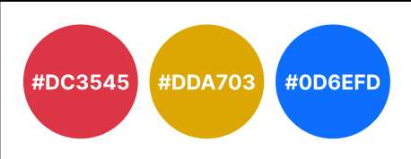
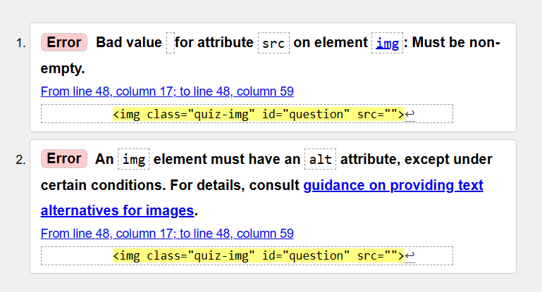

# Parrots Parrots Parrots!
[Link to website](https://lrchnnng.github.io/parrot-quiz/)

## Table of contents
[Table of contents](#table-of-contents)
* [Website Information](#website-information)
  - [Website purpose](#website-purpose)
  - [Website Sections:](#website-sections)
* [UX](#ux)
  - [Strategy](#strategy)
  - [Scope](#scope)
  - [Structure](#structure)
  - [Skeleton](#skeleton)
  - [Surface](#surface)
  - [Features](#features)
* [Technologies Used](#technologies-used)
* [Testing](#testing)
* [Deployment](#deployment)
* [Credits and Acknowledgments](#credits-and-acknowledgements)

## Website Information
Business goals: 
* Provide a fun and educational quiz for users
* Provide easily readable instructions
* Provide an easy to navigate website

### Website Sections:
1. Home/Landing Page
2. How to play
3. Quiz
4. Scores

---

## UX 
Whilst designing and creating this website I have taken into account the five planes of UX design, strategy, scope, structure, skeleton and surface.

### Strategy
I began by creating the foundation for my website, I defined my target user and the types of features and technologies. 

Target users for Parrots Parrots Parrots!:
* Ages 10 +
* Parrot lovers
* People who want to learn more about parrots

First time and returning user goals: 
* To learn about different species of parrots.
* To test current knowledge of various parrot species.
* To acesses high scores from previous test attempts.

Another goal for my website was to create an intuitive experience making the page easy to navigate without the user having to think too much about their next move. With the understanding that my user demographic is most likely viewing the website across a variety of devices, I have made sure that the site is fully responsive across screen sizes in order to optimize user experience.

### Scope
The second plane of UX looks at the **scope** of the website. What does the user have to do in order to reach both the user and the site owners goals for the website.

#### Features
- **Homepage:**
A simple landing page with a nav bar and navigation buttons to other pages on the site.
- **How to play:**
A page that explains how the quiz will work, includes a navigation button to begin the quiz.
- **Quiz:**
An interactive quiz page with an image as the question and four options for the user to choose from.
- **Scores:**
A page that takes the score from the quiz and displays the final user score once the quiz is finished.

### Structure
I created a userflow diagram to show how the user will interact with each page on the site.

### Skeleton
The **skeleton** plane of UX design is a more visual representation of the flow in which a user might use the website. Using wireframes to show a basic design layout 
removes colour, Typography, imagery to create a basic view of website and layout

**Mobile Wireframes**

**Tablet and Desktop Wireframes**

These wireframes are a simplified version of what I planned for the site. Some areas may have changed between the wireframes and the final product.

### Surface

#### Typography
I opted to use 'Montserrat' across the entire site as it is a simple and easy to read font that has a number of different style options that can be utilised in different areas.

#### Colours
I chose to use a simple primary colour palette to keep the pages looking clean and easy to read.

#### Photography
I used royalty free images of parrots from google images.

---

## Technologies Used
- [HTML](https://developer.mozilla.org/en-US/docs/Web/HTML)
  * Used to create the basic structure and meaning of the webpage
- [CSS](https://developer.mozilla.org/en-US/docs/Learn/Getting_started_with_the_web/CSS_basics)
  * Used to style the content within the webpage
- [Bootstrap](https://getbootstrap.com/)
  * Bootstrap was used to create a fully responsive navbar
- [JavaScript](https://www.javascript.com/)
  * Used with Bootstrap in order to create a responsive drop down nav bar on mobile and tablet devices
- [Google Fonts](https://fonts.google.com/)
  * Used to add in specific fonts to the webpage
---

## Testing
- **Lighthouse**
  
  * 
- **HTML and CSS Validation**
  * HTML
    
    All of the HTML pages passed the W3C HTML Validator apart from quiz.html.
    
    This error has appeared due to me leaving the img element source blank which is replaced within my quiz.js file. I fixed both of these issues by using a '#' as the source and creating a general, none specific alt text attribute (in this case it will always be a picture of a parrot). 
  * CSS
    
    All pages passed the W3C CSS Validation.
    
- **Known bugs and fixes**
  * Had issues with the score being logged once a button was disabled, attempted a multitude of fixes including:
    1. Adding if/else statements to event listener so that the checkAnswer() function is only called if the button is active.
    2. Adding if/else statements to checkAnswer() function so that if the button is disabled it cancels the calling of the function.
    3. **Solution**: Removed the event listener and the generated 'next' button and added onclick targets to each button within the html. With this fix I have had to sacrifice the fun fact and the correct/incorrect answer message.

- **JavaScript Testing
* I ran both quiz.js and score.js through JS Lint to test them for errors and issues. While there were some warnings related to the use of single and double quotes there were no major issues.
 
 

## User Story
1. Easily find the location of the festival
  

## Deployment
### GitHub pages deployment
Once this is complete you should be able to view the webpage online, this is updated every so often which allows the user to see any changes in almost real time.

*Log in to GitHub*
- In your Repository section, select the project repository that you want to deploy
- In the menu located at the top of this section, click 'Settings'
- Select 'Pages' on the left-hand menu - this is around halfway down
- In the source section, select branch 'Master' and save
- The page is then given a site URL which you will see above the source section
---

## Credits and Acknowledgments
- [Google Fonts](https://fonts.google.com/)
- [Figma](https://www.figma.com/)
  * Used to create user flows and wireframes.
- [ui.dev](https://ui.dev/amiresponsive)
  * Used to create a mockup of web page on various screen sizes.
