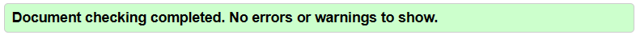
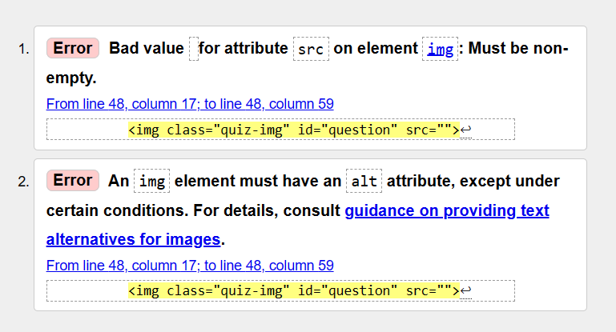
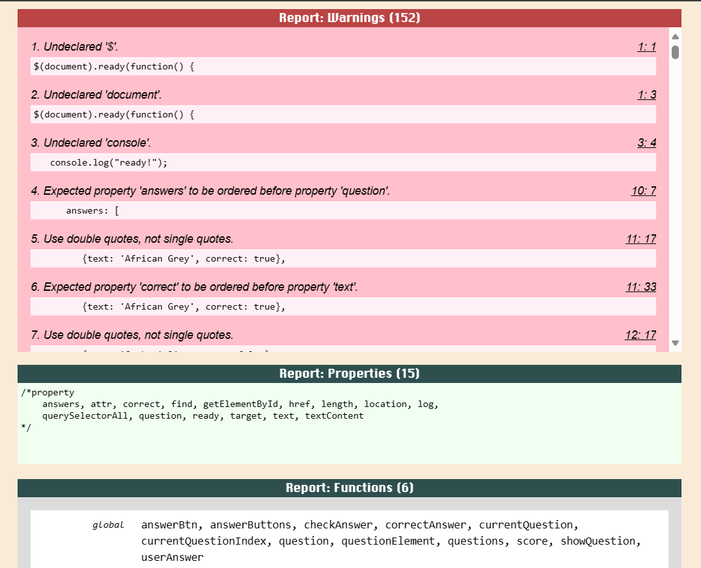
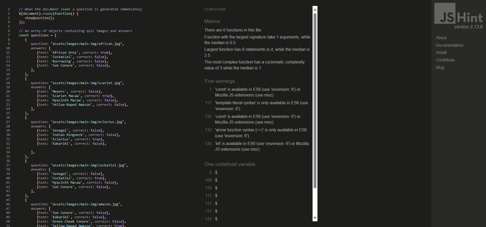
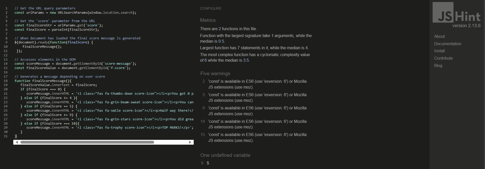
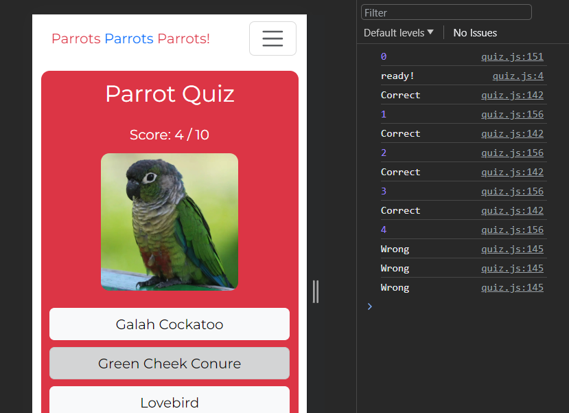
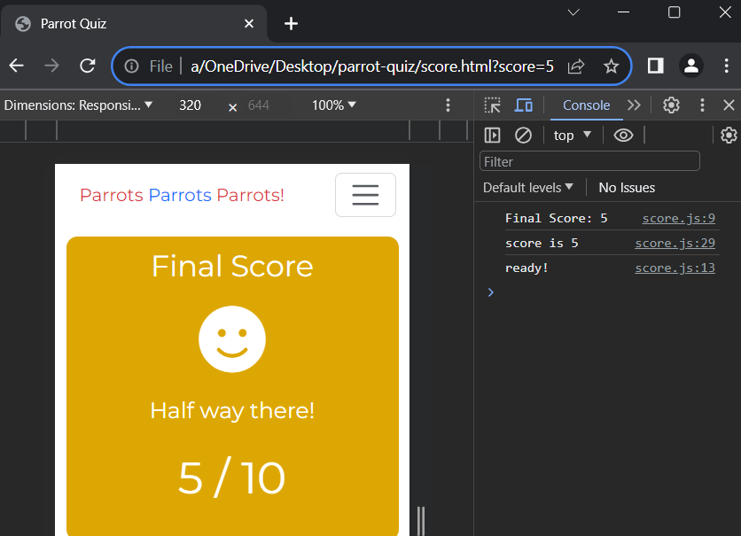

[Return to README](https://github.com/lrchnnng/parrot-quiz/blob/main/README.md)

# Testing
- [Lighthouse]{##lighthouse}
- [HTML and CSS](##html-and-css-validation)
- [JavaScript Testing](##javascript-testing)
- [Known Bugs and Fixes](##known-bugs-and-fixes)

## Lighthouse
  
  * 

## HTML and CSS Validation
  * HTML
    
    - All of the HTML pages passed the W3C HTML Validator apart from quiz.html.
    
    - This error has appeared due to me leaving the img element source blank which is replaced within my quiz.js file. I fixed both of these issues by using a '#' as the source and creating a general, none specific alt text attribute (in this case it will always be a picture of a parrot). 
  * CSS
    
    - All pages passed the W3C CSS Validation.
    
## JavaScript Testing
* I ran both quiz.js and score.js through JS Lint to test them for errors and issues. While there were some warnings related to the use of single and double quotes there were no major issues.
 
 
* I also ran both JS files through JSHint to make sure it was thoroughly tested.
 
 
* Thoughout development I used console logs to test that the functions worked as intended.
 
 

 ## Known bugs and fixes
  * Had issues with the score being logged once a button was disabled, attempted a multitude of fixes including:
    1. Adding if/else statements to event listener so that the checkAnswer() function is only called if the button is active.
    2. Adding if/else statements to checkAnswer() function so that if the button is disabled it cancels the calling of the function.
    **Solution**: Removed the event listener and the generated 'next' button and added onclick targets to each button within the html. With this fix I have had to sacrifice the fun fact and the correct/incorrect answer message.
