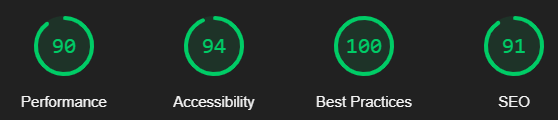

[Return to README](https://github.com/lrchnnng/parrot-quiz/blob/main/README.md)

---
# Testing <!-- omit in toc -->
- [Manual Testing](#manual-testing)
- [Automated Testing](#automated-testing)
- [Known bugs and fixes](#known-bugs-and-fixes)

---

## Manual Testing

| | Mobile S (320px)| Mobile L (425px)| Tablet (768px) | Desktop (1024px)|
|---|:---:|:---:|:---:|:---:|
|Responsive Images|✓|✓|✓|✓|
|Responsive Elements|✓|✓|✓|✓|
|Responsive Text|✓|✓|✓|✓|
|Responsive Nav Bar|✓|✓|✓|✓|

|Nav Bar Testing|Yes/No|
|---|:---:|
|Nav bar text and styles are loaded|✓|
|Nav bar collapse appears up to medium sized screens|✓|
|Nav links work as intended|✓|

|Index Page Testing|Yes/No|
|---|:---:|
|A title image is loaded and is respnsive across all screen sizes|✓|
|Two buttons appear on loading|✓|
|A blue button navigates to how to page|✓|
|A red buttom navigtes to quiz page|✓| 

|Quiz Page Testing|Yes/No|
|---|:---:|
|Quiz question generated when page loads|✓|
|When user selects an answer a new question is generated|✓|
|When user gets correct answer, score increases by 1 point|✓|
|When user gets incorrect answer, no action|✓|
|When quiz finishes, score is stored in URL and user is automatically navigated to Final Score page|✓|

|Final Score Page Testing|Yes/No|
|---|:---:|
|Final score is found in URL search paramater|✓|
|Final score string is changed to an integer using parseInt() function|✓|
|Final score is added to HTML through JaveScript DOM manipulation and appears correctly|✓|
|Final score message is generated depending on the score using if/else|✓|
|A randomised fun fact is selected from the array and added to the page|✓|
|A blue button navigates to quiz how to page|✓|
|A red button navigates back to quiz page|✓| <!-- omit in toc -->
---

## Automated Testing

 ### Lighthouse <!-- omit in toc -->

| Page | Test Results | Lighthouse Suggested Improvements |
|:---:|---|---|
|Index||Specifying a specific width and height of my title image, I wanted to retain as much responsivity as I could and opted to use bootstrap instead.|
|How To||As with the index page, utilising font-display to ensure the user can read any text if there is an issue/delay in the loading of webfonts, this could potentially improve this score.|
|Quiz||Properly sizing the images would reduce load time and cellular data, currently some images are oversized and are slowing down the time it takes for the page to load.|
|Final Score||Reducing unused JavaScript from the bootstrap bundle would decrease the amount of bytes consumed. I could do this either by removing them or defering them until they are needed.|

### HTML and CSS Validation <!-- omit in toc -->
### HTML <!-- omit in toc -->

- All of the HTML pages passed the W3C HTML Validator apart from quiz.html.

- This error has appeared due to me leaving the img element source blank which is replaced within my quiz.js file. I fixed both of these issues by using a '#' as the source and creating a general, none specific alt text attribute (in this case it will always be a picture of a parrot). 
### CSS <!-- omit in toc -->

- All pages passed the W3C CSS Validation.
    
## JavaScript Testing <!-- omit in toc -->
* I also ran both JS files through JSHint to make sure it was thoroughly tested.
 
 
* Throughout development I used console logs to test that the functions worked as intended.
 
 

 ## Known bugs and fixes 
  * Had issues with the score still being logged once a button was disabled, attempted a multitude of fixes including:
    1. Adding if/else statements to event listener so that the checkAnswer() function is only called if the button is active.
    2. Adding if/else statements to checkAnswer() function so that if the button is disabled it cancels the calling of the function.
    **Solution**: Removed the event listener and the generated 'next' button and added onclick targets to each button within the html. With this fix I have had to sacrifice the fun fact and the correct/incorrect answer message.
  * When user selects an answer the button from the previous selection remains depressed on the following question. In the future I would look at how to disable this button feature used by Bootstrap.